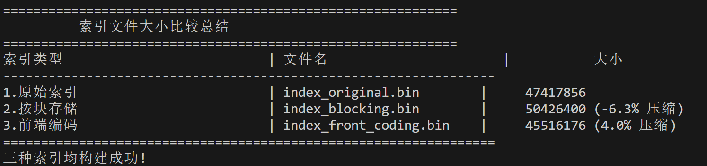
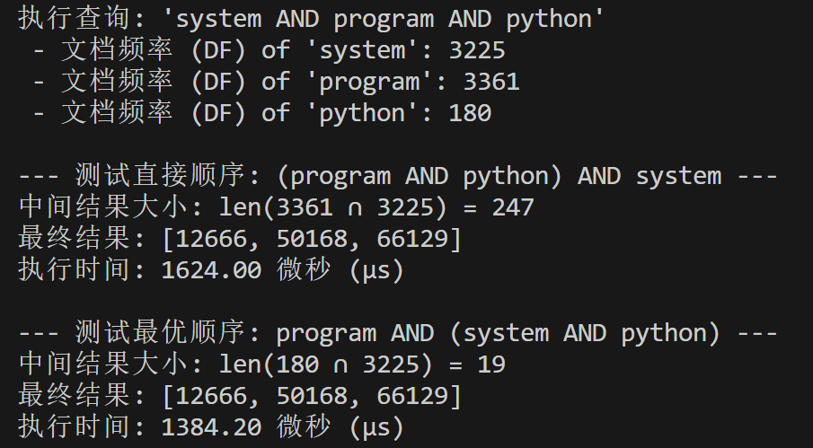
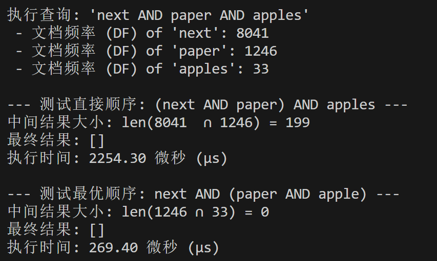
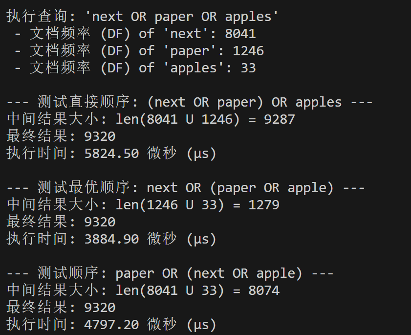
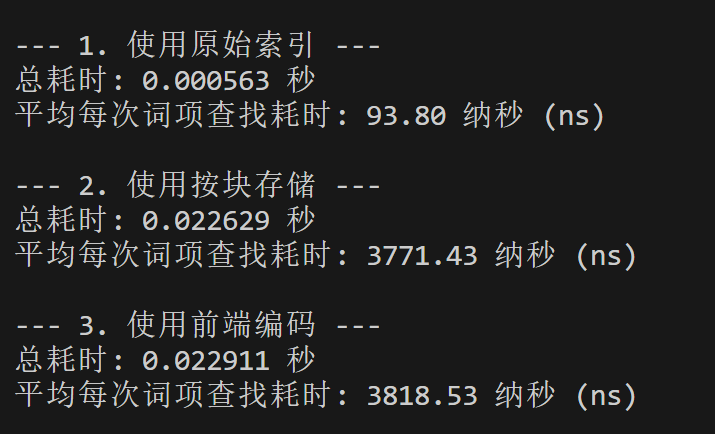
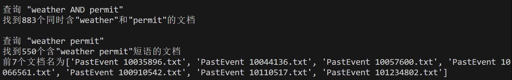
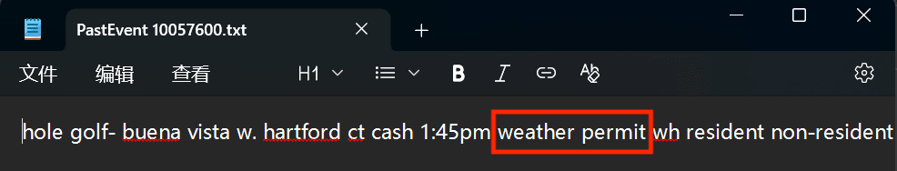
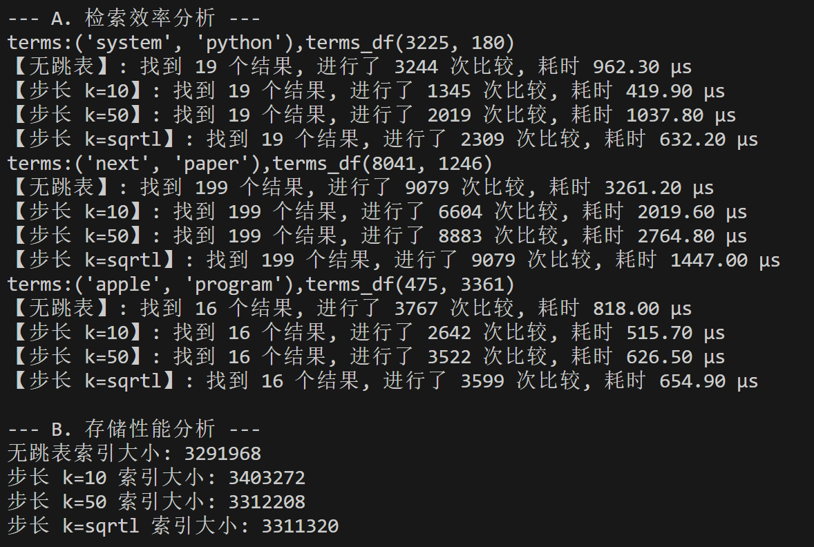
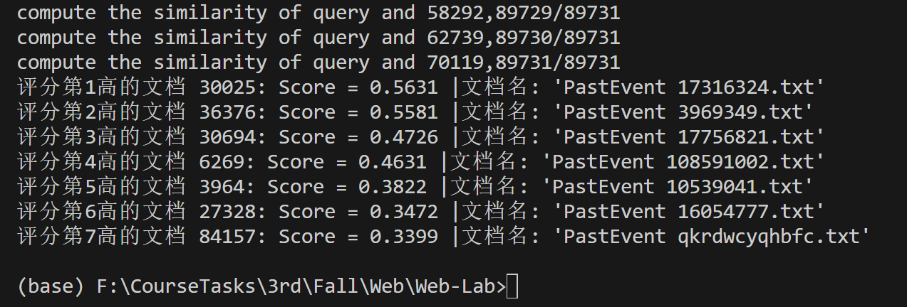
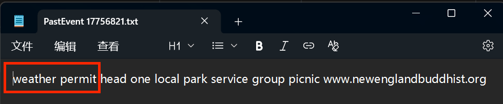

# Web Lab1 信息检索

> `小组成员：张启轩 PB23331868 、 蒋锐 PB23331862`

## 文档解析与规范化处理

> 这部分的代码部分位于文件夹`Lab1\XML_Parsing_And_Normalization`下

1.  **解析文档中所需的部分内容**
    *   对应`XML_Parser.py`中的内容
    *   主要函数:
        *   `xml_parser(directory_path, file_pattern, parsed_xml_output_dir)`
        *   `extract_event_descriptions_from_xml`
        *   `change_extension`
    *   `xml_parser`函数首先根据指定的路径(`directory_path`)和文件模式(`file_pattern`)，使用`glob.glob()`查找所有匹配的XML文件。对于每个找到的XML文件，它会调用`extract_event_descriptions_from_xml`函数来提取内容。该提取函数使用`lxml.etree`库解析XML，并找到所有`<description>`标签。接着，它对标签内的文本执行一系列清洗操作：首先使用`html.unescape()`进行HTML实体解码（例如，将`&amp;`转换为`&`），然后使用正则表达式`re.sub(r'<[^>]+>', '', ...)`去除所有HTML标签(如`<b>`, `<br>`)，最后使用`re.sub(r'\s+', ' ', ...).strip()`将多个连续的空白字符（包括换行符）替换为单个空格。处理后的纯净文本内容被写入到`Lab1\XML_Parsing_And_Normalization\parsed_xml_files`目录下，文件名与原XML文件相同，但扩展名通过`change_extension`函数更改为`.txt`。

2.  **对文档中的文本进行分词处理**
    *   对应`Tokenizer.py`中的内容
    *   主要函数:
        *   `tokenize(parsed_txt_dir, tokenized_txt_output_dir)`
    *   该函数负责读取上一步生成的、存放于`Parsed_xml_files`文件夹中的每一个文本文件。接着，它利用`nltk`库的`word_tokenize`函数对文件内容进行标准的分词处理。分词完成后，所有词项会以空格为分隔符重新组合成一个字符串，并写入到`Lab1\XML_Parsing_And_Normalization\Tokenized_txt_files`目录下的新文件中，为下一步的规范化处理做好准备。

3.  **对分词后的所有单词进行规范化处理**
    *   对应`Normalize.py`中的内容
    *   主要函数:
        *   `normalize(tokenized_txt_dir, normalized_txt_output_dir)`
        *   `get_wordnet_pos(tag)`
    *   此步骤是信息检索预处理的核心，将分词后的词项转换为标准形式。整个过程分为四个的阶段：
        1.  **Lowercasing**: 将所有词项统一转换为小写。
        ```py
        lowercasing_tokens = [token.lower() for token in tokens]
        ```
        2.  **Stop Word Removal**: 通过加载`nltk.corpus.stopwords`提供的标准英文停用词列表，并过滤掉所有出现在该列表中的词项来完成此操作。
        ```py
        stop_words = set(stopwords.words('english'))
        tokens_without_stopwords = [
        token for token in lowercasing_tokens if token not in stop_words
        ]
        ```
        3.  **Punctuation and Number Removal**: 进一步清洗词项，移除所有完全由数字构成（如 "2023"）或完全由标点符号构成（如 "--"）的词项。代码通过正则表达式`re.fullmatch(r'[-+]?\d+(\.\d+)?', token)`来精确匹配数字，并通过`all(char in punctuation for char in token)`来识别纯标点符号。
        4.  **词形还原 (Lemmatization)**: 使用`nltk.stem.WordNetLemmatizer`，并结合了词性标注。首先通过`nltk.pos_tag`为每个词项标注词性，然后`get_wordnet_pos`函数将NLTK的词性标签转换为WordNetLemmatizer所能理解的格式，从而进行更精确的词形还原。包含下划线 `_` 的多词短语则被特殊处理，不进行词形还原以保留其整体性。(`is_multi_word_phrase()`)
        ```py
        lemmatizer = WordNetLemmatizer()
        tokens_lemmatized = []
        pos_tagged_tokens = nltk.pos_tag(tokens_clean)
        for token, tag in pos_tagged_tokens:
            if is_multi_word_phrase(token):
                tokens_lemmatized.append(token) # 短语不进行词形还原
            else:
                wordnet_pos = get_wordnet_pos(tag)
                lemmatized_word = lemmatizer.lemmatize(token, pos=wordnet_pos)
                tokens_lemmatized.append(lemmatized_word)
        ```
    *   所有规范化步骤完成后，最终得到的标准词项列表被写入`Lab1\XML_Parsing_And_Normalization\Normalized_txt_files`目录下的相应文件中，可用于后续建立倒排索引等操作。
  

## 倒排表的构建

> 这部分的代码部分位于文件夹`Lab1\Posting_List`下

1.  **构建倒排表**
    *   对应`Construct_PostingList.py`中的内容
    *   主要函数:
        *   `construct_postinglist(normalized_txt_dir)`
    *   该函数负责读取 `Normalized_txt_files` 文件夹中所有经过规范化处理的文档，并在此基础上构建一个倒排索引。
    *   **处理流程**：
        1.  **文档ID分配**: 首先，函数遍历所有文档，并为每个文档的文件名分配一个从1开始的唯一整数ID。这个映射关系存储在 `filename_to_ID` 字典中。
        ```py
        ID = 1
        for file in txt_files:
            base = os.path.basename(file)
            filename_to_ID[base] = ID
            ID += 1
        ```
        2.  **倒排索引构建**: 接着，函数再次遍历所有文档。对于每个文档中的每一个词项，它会查找这个词项是否已经存在于 `postinglist` 字典中。
            *   如果词项是第一次出现，函数会以该词项为键，创建一个只包含当前文档ID的列表作为值。
            *   如果词项已经存在，函数会检查该词项对应的列表中最后一个文档ID是否就是当前文档的ID。通过 `if filename_to_ID[base] != postinglist[token][-1]` 这个判断，可以确保每个文档的ID在一个词项的倒排列表中只出现一次，即使这个词项在文档中出现了多次。如果ID不同，则将当前文档的ID追加到列表末尾。
        ```py
        for file in txt_files:
            tokens = []
            with open(file, 'r', encoding='utf-8') as f:
                content = f.read()
                tokens = content.strip().split()
            base = os.path.basename(file)
            print(f"正在处理: {base}"+ f"词项数: {len(tokens)}")
            for token in tokens:
                if token not in postinglist.keys():
                    postinglist[token] = [filename_to_ID[base]]
                else:
                    if filename_to_ID[base] != postinglist[token][-1]: # 确保文档ID唯一
                        postinglist[token].append(filename_to_ID[base])
        ```
    *   **最终结果**：函数执行完毕后，返回 `filename_to_ID` 映射表和 `postinglist` 字典.

2.  **设计合适的跳表指针**
    *   对应`Construct_PostingList.py`中的内容
    *   主要函数:
        *   `add_skip_pointers(postinglist)`
    *   **设计与实现**：
        1.  **步长选择**: 对于每一个词项的倒排列表，我们将步长设置为列表长度的平方根，即 `stride = math.floor(math.sqrt(len(IDList)))`。
        2.  **指针添加**: 函数遍历每个词项的倒排列表。在列表的第 `i` 个位置，如果 `i` 是步长的整数倍（`i % stride == 0`）并且指针的目标位置（`i + stride`）没有超出列表范围，就在该位置添加一个跳表指针。这个指针指向从当前位置前进 `stride` 步之后的位置上的文档ID。
        3.  **数据结构**: 为了存储这些指针，我们将原始的倒排列表（一个整数列表）转换成一个元组（tuple）列表。每个元组的第一个元素是原始的文档ID，第二个元素是跳表指针。如果没有跳表指针，则第二个元素为 `None`。
        ```py
        for token, IDList in postinglist.items():
            stride = math.floor(math.sqrt(len(IDList)))
            IDList_with_pointers = []
            for i,ID in enumerate(IDList):
                if i % stride == 0 and i + stride < len(IDList):
                    IDList_with_pointers.append((ID,IDList[i + stride]))
                else:
                    IDList_with_pointers.append((ID,None))
            postinglist[token] = IDList_with_pointers
        ```
    *   **最终结果**: 该函数返回一个带有跳表指针的增强版倒排索引。

## 倒排表的扩展与优化

> 这部分的代码部分位于文件夹`Lab1\Posting_List`下

1.  **加入词项的位置信息**
    *   对应`PostingListWithPositionalIndex.py`中的内容
    *   主要函数:
        *   `construct_postinglist_with_positional_index(normalized_txt_dir)`
        *   `separate_index_and_postings_with_df_in_memory(...)`
        *   `retrieve_postings_list_only(token, term_dict, postings_filename)`
    *   **实现方式**:
        *   在`construct_postinglist_with_positional_index`函数中，修改了倒排表的数据结构。现在，对于每个词项，其倒排列表不再仅仅是文档ID的列表，而是一个包含`(文档ID, [位置1, 位置2, ...])`元组的列表。
        *   在遍历每个文档的词项时，我们维护一个`position_index`计数器，从0开始递增。当遇到一个词项时，我们会记录下它当前的`position_index`。
        *   如果一个词项在同一个文档中出现多次，它的所有出现位置都会被追加到对应文档ID的位置列表中。
        ```py
        for file in txt_files:
            tokens = []
            with open(file, 'r', encoding='utf-8') as f:
                content = f.read()
                tokens = content.strip().split()
            base = os.path.basename(file)
            print(f"正在处理: {base}"+ f"词项数: {len(tokens)}")
            position_index = 0
            for token in tokens:
                if(len(token) > 255):
                    continue
                if token not in postinglist.keys():
                    postinglist[token] = []
                    token_positional_index_list = []
                    token_positional_index_list.append(position_index)
                    postinglist[token].append((filename_to_ID[base],token_positional_index_list))  
                else:
                    if filename_to_ID[base] != postinglist[token][-1][0]: # 确保文档ID唯一
                        token_positional_index_list = []
                        token_positional_index_list.append(position_index)
                        postinglist[token].append((filename_to_ID[base],token_positional_index_list))  
                    else:
                        postinglist[token][-1][1].append(position_index)
                
                position_index += 1 
        ```
    *   **索引与倒排列表分离**:
        *   为了下一步压缩索引，代码中还引入了`separate_index_and_postings_with_df_in_memory`函数。该函数将完整的倒排表结构拆分为两部分：
            1.  **词项词典 (Term Dictionary)**: 包含每个词项、其文档频率(DF)、以及一个指向磁盘上倒排列表的指针（由偏移量 `offset` 和数据大小 `size` 组成）。
            2.  **倒排列表文件 (Postings File)**: 一个二进制文件，顺序存储了所有词项的、包含位置信息的倒排列表。
    *   **使用索引从分离后的倒排表中获得倒排表内容**
    ```py
    with open(postings_filename, "rb") as f:
        f.seek(offset)
        serialized_data = f.read(size)
        postings_list = pickle.loads(serialized_data)
        return postings_list
    ```
2.  **索引压缩**
    *   为了进一步减小词项词典在磁盘和内存中的占用空间，采用了两种的压缩技术：按块存储和前端编码。
    *   **按块存储 (Blocking)**
        *   对应函数: `compress_with_blocking(term_dict, k=4)、find_token_in_blocked_dict(query_token, block_string, block_meta, full_meta, k)`
        *   **原理**: 该方法将所有按字典序排序的词项拼接成一个长字符串。为了能够快速定位到任意词项，并不为每个词项都保留一个指针，而是每隔 `k` 个词项（一个“块”）才存储一个指向该块第一个词项的指针。
        *   **实现细节**:
            *   将所有词项按字母顺序排序。
            *   创建一个`block_string`，其中每个词项以`<长度><词项>`的格式存储（长度用单个字节表示）。
            *   创建一个`block_metadata`列表，用于存储每个块的第一个词项及其在`block_string`中的起始指针。
            ```py
                for i in range(0, len(sorted_tokens)):
                    token = sorted_tokens[i]
                    
                    full_sorted_metadata.append(term_dict[token])
                    
                    if i % k == 0:
                        block_metadata.append((token, current_char_offset))

                    if len(token) > 255:
                        raise ValueError(f"Token '{token}' is too long for single-byte length storage.")    
                    string_builder.append(chr(len(token)))
                    string_builder.append(token)
                    
                    current_char_offset += 1 + len(token)

                block_string = "".join(string_builder)
            ```
            *   查询时（`find_token_in_blocked_dict`），首先通过对`block_metadata`进行二分查找，快速定位到可能包含查询词项的块。
            ```py
            # 二分查找找query所属快
            while low <= high:
                mid = (low + high) // 2
                first_term_in_block = block_meta[mid][0]
                
                if first_term_in_block <= query_token:
                    target_block_index = mid
                    low = mid + 1
                else:
                    high = mid - 1
            ```
            *   然后，只在该块内部进行顺序扫描，解码每个词项并进行比较，从而找到目标词项。
            ```py
            block_start_char_ptr = block_meta[target_block_index][1]
    
            if target_block_index + 1 < len(block_meta):
                block_end_char_ptr = block_meta[target_block_index + 1][1]
            else:
                block_end_char_ptr = len(block_string)

            current_pos = block_start_char_ptr
            term_index_in_block = 0
            
            while current_pos < block_end_char_ptr:

                term_len = ord(block_string[current_pos])
                
                term = block_string[current_pos + 1 : current_pos + 1 + term_len]

                if term == query_token:
                    global_index = (target_block_index * k) + term_index_in_block
                    return full_meta[global_index]

                current_pos += 1 + term_len
                term_index_in_block += 1
            ```

    *   **前端编码 (Front Coding)**
        *   对应函数: `find_common_prefix_len(s1, s2)、compress_blocking_with_front_coding(term_dict, k=4)、find_token_in_blocked_front_coded_dict(query_token, block_string, block_meta, full_meta, k)`
        *   **原理**: 在按块存储基础上的增强压缩。它利用了按字典序排序后，一个块内相邻词项通常具有相同前缀的特点。
        *   **实现细节**:
            *   在每个块中，第一个词项被完整存储。
            *   对于块内的后续词项，我们不再存储整个词项，而是存储它与 **前一个词项** 的公共前缀的长度、剩余后缀的长度以及后缀本身，格式为`<前缀长度><后缀长度><后缀>`。
            *   例如，对于块内的 "automate", "automatic", "automation"，可以编码为: `8automate...17ic...2c...7ion`。
            ```py
            for i in range(0, len(sorted_tokens), k):
                block_tokens = sorted_tokens[i : i + k]
                
                if not block_tokens: continue

                first_term_in_block = block_tokens[0]
                block_metadata.append((first_term_in_block, current_char_offset))

                string_builder.append(first_term_in_block)
                current_char_offset += len(first_term_in_block)
                
                for j in range(1, len(block_tokens)):
                    previous_token = block_tokens[j-1]
                    current_token = block_tokens[j]

                    prefix_len = find_common_prefix_len(previous_token, current_token)
                    suffix = current_token[prefix_len:]
                    suffix_len = len(suffix)

                    if prefix_len > 255 or suffix_len > 255:
                        raise ValueError("Prefix or suffix too long for single-byte storage.")

                    string_builder.append(chr(prefix_len))
                    string_builder.append(chr(suffix_len))
                    string_builder.append(suffix)
                    
                    current_char_offset += 2 + suffix_len # 2 bytes for lengths + suffix

            block_string = "".join(string_builder)
            ```
            *   查询时（`find_token_in_blocked_front_coded_dict`），首先同样通过二分查找定位到块。然后从块的第一个完整词项开始，逐个解码和重构后续的词项，直到找到查询目标或遍历完整个块。

    *   **比较**
        *   在主程序入口 (`if __name__ == "__main__":`) 部分，代码对三种索引策略的内存占用进行了量化比较：
            1.  **原始索引**: 未经压缩、直接使用Python字典存储的词项词典。
            2.  **按块存储索引**: 使用Blocking方法压缩后的索引结构。
            3.  **前端编码索引**: 结合Blocking和Front Coding压缩后的索引结构。
        *   代码使用`pympler.asizeof`库精确计算了这三种数据结构在内存中的深度大小，并打印出一个比较表格，同时计算了两种压缩方法相对于原始索引的压缩率。如下图所示：
        *   
        *   可以看出只有前端编码有些许压缩，按块存储索引甚至还变大了。分析原因是因为在python里，对象本来就不是定长存储的，我们希望对字符串长度进行压缩，实际上由于字符串本身就是变长存储，只使用定长的指针。所以将所有token压缩为一个字符串仅仅减少了指针的数量，但又增加了对于这个长字符串的索引，这部分的大小多与对减少了指针的数量的影响，所以按块存储反而变大了，而前端编码相比而言，提取了公共前缀，真正压缩了token的存储，但由于增加了别的索引，所以对原始索引的压缩程度没有达到预期。
        

## 多种形式的信息检索

> 这部分的代码部分位于文件夹`Lab1`下

### 1. 布尔检索

#### 1.1 3种以布尔表达式的形式呈现的复杂查询条件

*   对应`Boolean_Search.py`中的内容
*   主要函数:
    *   `intersect_postings(p1, p2)`: 实现两个倒排表的 "AND" 操作。
    *   `union_postings(p1, p2)`: 实现两个倒排表的 "OR" 操作。
*   **实现原理**:
    *   `intersect_postings` 函数接收两个按文档ID排序的倒排列表 `p1` 和 `p2`。它使用两个指针 `i` 和 `j` 同步地遍历这两个列表。如果两个指针指向的文档ID相同，则将该条目加入结果集，并且两个指针同时前进；如果不同，则将指向较小ID的指针前进。这个过程一直持续到其中一个列表遍历完毕。
    ```py
    result = []
    i, j = 0, 0
    while i < len(p1) and j < len(p2):
        docID1 = p1[i][0]
        docID2 = p2[j][0]
        
        if docID1 == docID2:
            result.append(p1[i])
            i += 1
            j += 1
        elif docID1 < docID2:
            i += 1
        else: 
            j += 1
    ```
    *   `union_postings` 函数同样使用双指针法。如果两个ID相同，则将任意一个条目加入结果集，两个指针都前进；如果不同，则将较小的ID对应的条目加入结果集，并将对应的指针前进。在一个列表遍历结束后，将另一个列表中剩余的所有条目追加到结果集末尾。
    ```py
    while i < len(p1) and j < len(p2):
        docID1 = p1[i][0]
        docID2 = p2[j][0]
        
        if docID1 == docID2:
            result.append(p1[i]) 
            j += 1
        elif docID1 < docID2:
            result.append(p1[i])
            i += 1
        else: 
            result.append(p2[j])
            j += 1
            
    while i < len(p1):
        result.append(p1[i])
        i += 1
    while j < len(p2):
        result.append(p2[j])
        j += 1
    ```
*   **查询优化**:
    *   在处理包含多个 "AND" 操作的查询时（例如 `term1 AND term2 AND term3`），查询的执行顺序会显著影响效率。一个核心的优化策略是 **按文档频率 (DF) 从低到高** 的顺序进行合并操作。
    *   代码通过执行 `system AND program AND python` 和 `next AND paper AND apples` 两个查询，并比较了不同合并顺序的性能。实验中有意选择了按DF升序的“最优”顺序和按字母序的“直接”顺序。
    
    
    
    *   **原因分析**: `intersect` (AND)操作的结果集大小不会超过其任何一个输入集的大小。因此，先合并两个最短的倒排列表（即DF最低的词项），可以产生一个尽可能小的中间结果。后续的合并操作将在这个较小的中间结果上进行，从而大大减少了总的比较次数和计算量。对于 `Union`(OR) 操作，虽然也是优先处理 DF 较小的词项，但从第三个查询可以看出，这对速度的影响程度小于`intersect`。

#### 1.2 根据倒排表进行检索，并比较索引压缩前后在检索效率上的差异

*   对应`Boolean_Search.py`中的 `#5.A.2` 部分
*   **测试方法**:
    *   该部分代码旨在比较从不同压缩程度的词项词典中 **查找词项指针** 的效率。选取了6个代表性的查询词，并对每种索引结构（原始索引、按块存储、前端编码）执行了1000次循环查找。
    *   通过记录和计算平均每次查找所需的时间，我们可以量化不同压缩策略对查找性能的影响。
*   **性能分析**:
    1.  **原始索引 (Python字典)**: 查找效率最高。这是因为它直接利用了哈希表（Hash Table）的优势，平均查找时间复杂度接近 O(1)。
    2.  **按块存储 (Blocking)**: 查找效率次之。查找过程包括一次在块元数据上的二分查找（`log(N/k)`）和一次在块内的顺序扫描（最多 `k` 次），因此速度慢于哈希表，但仍相当高效。
    3.  **前端编码 (Front Coding)**: 查找效率最低。除了需要像按块存储一样先定位到块，它还需要在块内逐个重构词项来进行比较，这个重构过程引入了额外的计算开销，使其成为三者中最慢的。
    
*   **结论**: 这是一个典型的 **空间换时间** 的权衡。从结果可以看出，原始索引远远快于后两者，后两者按块存储比前端编码快一点点，因为前端编码比按块存储多了解码字符串的步骤，但影响很小

#### 1.3 面向短语的检索

*   对应`Boolean_Search.py`中的 `#5.A.3` 部分
*   主要函数:
    *   `intersect_postings_with_pos(p1, p2)`
    *   `intersect_positions_with_distance(pos_list1, pos_list2, distance)`
*   **实现流程**:
    *   短语查询（例如 `"weather permit"`）要求查询的词项不仅要出现在同一文档中，还必须以特定的顺序相邻出现。代码采用了一个两阶段的处理方法：
    1.  **文档过滤阶段**: 首先，将短语查询视为一个布尔 "AND" 查询。代码调用 `intersect_postings_with_pos` 函数，找到所有 **同时包含** "weather" 和 "permit" 的文档。这个函数返回一个包含成对倒排条目的列表，例如 `[ ( (docID, [pos...]), (docID, [pos...]) ), ... ]`，其中每对条目都来自同一个文档。
    2.  **位置验证阶段**: 接着，对于上一步筛选出的每一个候选文档，代码调用 `intersect_positions_with_distance` 函数。这个函数会检查 "weather" 的位置列表和 "permit" 的位置列表，看是否存在一个位置 `pos1` (来自weather) 和一个位置 `pos2` (来自permit) 满足 `pos2 = pos1 + 1`。这正是 "weather" 后面紧跟着 "permit" 的条件。该函数同样采用高效的双指针法进行遍历比较，一旦找到满足条件的配对，就立即返回 `True`，并将该文档ID加入最终结果集。
    ```py
    for entry1, entry2 in candidate_pairs:
        docID = entry1[0]
        pos_list1 = entry1[1]
        pos_list2 = entry2[1]
        
        if intersect_positions_with_distance(pos_list1, pos_list2, 1):
            final_docs.append(docID)
    ```
* 
* 查看结果中前三个文档，均找到了`"weather permit"`
* 
* 
* 

#### 1.4 选择不同的跳表指针步长，并分析其对存储性能/检索效率的影响

*   对应`Boolean_Search.py`中的 `#5.A.4` 部分
*   主要函数:
    *   `build_skip_list(postings_list, step)`
    *   `intersect_with_skips(p1_with_skips, p2_with_skips)`
*   **检索效率分析**:
    *   代码通过对三对不同文档频率的词项进行 `intersect` 操作，系统地比较了四种跳表策略的性能：无跳表、步长 `k=10`、步长 `k=50` 以及理论最优步长 `k=sqrt(L)`（L为列表长度）。
    *   **实验结果**:
    *  
        *   **无跳表** 的情况下，比较次数最多，耗时最长，是性能的基准线。
        *   **引入跳表后**，比较次数和执行时间都显著下降。当一个指针指向的ID远小于另一个时，跳表允许它一次性“跳过”多个不可能是交集的元素，从而避免了大量的逐一比较。
        *   **步长的影响**: 步长 `k` 的选择是一个权衡。`k` 太小，指针过多，增加了存储开销，且每次跳跃的步子太小，优化效果有限。`k` 太大，指针过少，导致很多可以跳跃的机会被错过。从实验数据可以看出，对于不同长度的倒排列表，`k=sqrt(L)` 策略通常能提供最稳定和接近最优的性能，因为它动态地适应了列表的长度。
*   **存储性能分析**:
    *   代码使用 `pympler.asizeof` 库精确测量了不同跳表策略下，倒排列表（包含跳表指针数据结构）在内存中的大小。
    *   **分析**: 存储大小与跳表指针的数量成正比。无跳表时索引最小。随着步长 `k` 的减小（即指针变多），索引的总体积会增大。`k=10` 的索引比 `k=50` 的大，而 `k=sqrt(L)` 的大小则介于两者之间，具体取决于列表的长度。
*   **结论**: 跳表指针是一种以适度的存储空间增长为代价，换取布尔查询中 `intersect` 操作性能显著提升的有效技术。最优步长的选择依赖于倒排列表的长度，而 `k=sqrt(L)` 是一个普适性很强的启发式策略。

### 2. 向量空间模型

*   对应`SVM.py`中的内容
*   **模型概述**: 向量空间模型 (VSM) 是一种经典的文档排序模型。它将每个文档和用户的查询都表示为高维空间中的一个向量，向量的每个维度对应一个词项，维度上的值是该词项的权重。通过计算查询向量与每个文档向量之间的相似度（通常是余弦相似度），可以对文档进行排序，从而返回与查询最相关的结果。
*   **实现步骤**:
    1.  **计算IDF (Inverse Document Frequency)**:
        *   `compute_idf` 函数首先为词典中的每一个词项计算其IDF值。IDF衡量了一个词项提供信息量的多少，其计算公式为 `log10(N / df)`，其中 `N` 是文档总数，`df` 是包含该词项的文档数。一个词项越稀有，其IDF值越高。
        *   ```py
            for token in term_dict.keys():
                df = term_dict[token][0]
                idf_scores[token] = math.log10(N / df)
            ```
    2.  **构建文档向量**:
        *   `compute_doc_vectors` 函数负责为语料库中的每一个文档构建其TF-IDF向量。它遍历整个倒排表，对于文档 `d` 中的每一个词项 `t`：
            *   计算其 **TF (Term Frequency)** 权重：`1 + log10(freq(t, d))`，其中 `freq(t, d)` 是词项 `t` 在文档 `d` 中出现的次数。
            *   计算该词项的 **TF-IDF权重**: `TF_weight * IDF(t)`。
        *   最终，每个文档被表示为一个 ` {token: tf_idf_score, ...} ` 形式的字典（稀疏向量）。
        *   ```py
             for token in term_dict.keys():
                p = retrieve_posting_list_entry(token, term_dic)
                for (docID, index) in p:
                    tf_score = 1 + math.log10(len(index))
                    tf_idf_score = tf_score * idf[token]
                    doc_vectors[docID][token] = tf_idf_score
            ```
    3.  **查询处理与相似度计算**:
        *   `search_vsm` 函数接收一个自由文本查询。它首先将查询本身也转换为一个TF-IDF向量。
        *   然后，它遍历所有文档向量，并调用 `cosine_similarity` 函数计算查询向量和每个文档向量之间的余弦相似度。
        *   余弦相似度的计算公式为 `dot_product(v1, v2) / (norm(v1) * norm(v2))`。代码利用 `numpy` 库进行高效的向量点积和范数计算。
    4.  **排序和返回结果**:
        *   所有文档的相似度分数计算完毕后，`search_vsm` 函数根据分数从高到低对文档进行排序，并返回排序后的列表。
        *   代码最后以 `"weather permit"` 为例，演示了如何使用该模型进行查询，并打印出评分最高的7个文档及其相似度分数和文件名。
        *   
        *   结果如图所示，查看前三名的文档可以看出都是很短小的文档，使得`"weather permit"`的占比高，所以余弦相似度高
        *   
        *   
        *   
        *   最后我还思考了为评分第一的文档的词数多于评分第二的文档，打印出向量值发现，评分第一的文档的别的token数虽多与评分第二的文档，但其多余token的分值低，导致虽然文档向量的非零值低，但其模长实际上小于评分第二的文档

